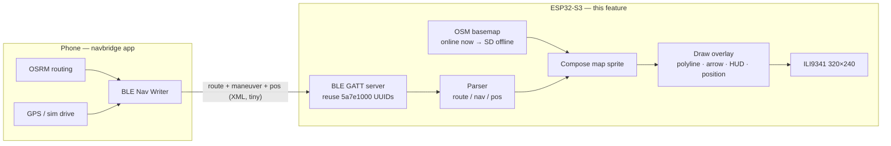

# PLAN — BLE Navigation Overlay on OSM Map (ESP32-S3 + ILI9341)

Feature: the phone (navbridge app) routes with OSRM and **emits nav data over BLE**;
the ESP32-S3 renders a live OSM map with the **route polyline, turn arrow, distance,
street name, and current position** drawn on top.

This is the design doc for extending the working OSM tile viewer (`osm_touch`) with a
BLE navigation overlay. It deliberately **does not send images over BLE** — only small
structured nav data (route + maneuver + position), because BLE gives ~10–40 KB/s while
a 320×240 JPEG is ~30–80 KB (1–3 s/frame). See "Why not JPG" below.

---

## 1. Current state (what already works)

| Piece | Where | Notes |
|-------|-------|-------|
| OSM tile fetch + decode + compose | `osm_touch` (Arduino, PlatformIO) | `OpenStreetMap-esp32` lib, LovyanGFX + PNGdec, dual-core, reused TLS, PSRAM cache — **working, colors fixed** |
| Touch pan (FT6336) | `osm_touch/src/main.cpp` | LovyanGFX touch, raw mapping `screenX = 319 − rawY`, `screenY = rawX` — **verified** |
| BLE GATT server (NimBLE, XML) | `car_nav/src/ble_server.c` | Service `5a7e1000-2b2f-4f66-9f9a-5c0f8e1a2b3c`, char `5a7e1001-…` (Write/WriteNoResp); packets finalized on `</map>` / `</nav>` / `0x00`; advert name `EINK-MAP` |
| Phone routing app | `navbridge` (Flutter/web) | OSM + Nominatim + OSRM (no API keys), simulated drive mode, emits nav over BLE |
| Board | ES3C28P / ES3N28P | ESP32-S3, 16MB flash, 8MB PSRAM, ILI9341 320×240, FT6336 touch, **microSD slot** (used by MP3 demo) |

## 2. Architecture



**Roles:** phone = routing + GPS source. ESP32 = map renderer + BLE consumer. The phone
**never sends pixels**; it sends coordinates/instructions. (For offline: phone uses a
downloaded OSRM extract; ESP32 reads pre-cached tiles from microSD.)

## 3. BLE protocol (compatible with navbridge app)

Keep the existing GATT layout so the current app connects unchanged:

- Service `5a7e1000-2b2f-4f66-9f9a-5c0f8e1a2b3c`
- Char   `5a7e1001-2b2f-4f66-9f9a-5c0f8e1a2b3c` — **Write / WriteNoResp**
- Packet is complete when `</route>`, `</nav>`, `</pos>` or `0x00` is received
  (handles any chunking).

Proposed payloads (compact XML; ~1–5 KB per route, ~50–100 B per maneuver):

```
<!-- full route polyline, sent once -->
<route z="15"><p lat="10.7718" lon="106.6982"/><p lat="10.7720" lon="106.6985"/>...</route>

<!-- current maneuver, updated ~1 Hz -->
<nav d="85" m="left" s="Nguyễn Huệ"/>

<!-- live position / speed, ~1 Hz -->
<pos lat="10.7719" lon="106.6983" spd="34" hdg="312"/>
```

`m` (maneuver) one of: `left right slight-left slight-right straight u-turn roundabout arrive`.

**Future optimization (optional):** binary framing (1-byte type + deltas for lat/lon) to
shrink a city route to <1 KB — but XML is fine for v1 and matches the existing app.

## 4. Rendering plan (on top of `osm_touch`)

1. **Route polyline** — decode `<route>` points; project each lat/lon to tile-pixel via
   Web Mercator (same math as `panByPixels` in `main.cpp`); draw with
   `mapSprite.drawLine()` into the composed map sprite **before** `pushSprite`.
2. **Auto-fit** — compute the route bounding box → center `fetchMap` on it (and/or on the
   live `<pos>`).
3. **Maneuver HUD** — draw a big arrow glyph + `d` (distance) + `s` (street) into a
   corner banner on the sprite (clear the banner area each frame).
4. **Position marker** — draw current `<pos>` as a filled circle; recenter + redraw when
   it moves more than ~40 px from screen center (auto-follow).
5. **Optional heading** — rotate a heading wedge (needs `pushRotateZoom` sprite support).

Draw order: tiles → route polyline → position marker → HUD banner → `pushSprite`.

## 5. Implementation phases

- [ ] **P0 — Repo hygiene**: `.gitignore` (build logs, `car_nav/build`, `preview`, `sdkconfig`), commit baseline.
- [ ] **P1 — BLE GATT server on S3**: add `BLEDevice` (ESP32-BLE-Arduino) to `osm_touch`; advertise `NAV-OSM`; reuse UUIDs above; write callback → byte ring buffer.
- [ ] **P2 — Parser**: state machine that accumulates bytes and emits `route` / `nav` / `pos` events on closing tag.
- [ ] **P3 — Route overlay**: project + draw polyline on the OSM sprite; auto-fit bounding box; verify against the sim-drive route from navbridge.
- [ ] **P4 — Maneuver HUD**: arrow + distance + street banner; update at 1 Hz; verify turn changes while driving the sim route.
- [ ] **P5 — Live position + auto-follow**: draw `<pos>` marker; recenter when off-center; heading wedge optional.
- [ ] **P6 — Offline (future)**: pre-cache route-corridor tiles (`{z}/{x}/{y}.png`) to microSD; render from `SD_MMC` instead of network; optional NEO-6M GPS for device-side position.
- [ ] **P7 — Polish**: colors/contrast, fonts (Vietnamese), sleep/wake with BLE, battery path.

## 6. Testing

- **Unit (PC):** feed canned XML (`<route>`/`<nav>`/`<pos>`) through the parser; print
  decoded events over serial.
- **On-board:** `pio run -t upload` → capture serial → send test packets from
  navbridge app (or a python BLE writer) → verify overlay + auto-follow on screen.
- **Checklist:** route draws correctly at z15; arrow+distance update live; map follows
  position; no memory growth over a long drive (PSRAM usage stable).

## 7. Open decisions

1. Implement in **`osm_touch` (Arduino)** vs extending **`car_nav` (ESP-IDF/LVGL)** —
   recommended: `osm_touch` (faster iteration, OSM viewer already working + touch).
2. Keep **XML** protocol (app-compatible) vs switch to binary — XML for v1.
3. Offline tile zoom range for SD (z14–z16 corridor ≈ ~450 tiles ≈ ~10 MB for 10 km strip).

## 8. References

- navbridge app: https://github.com/DangLamTung/navbridge
- Existing BLE server: `car_nav/src/ble_server.c` (NimBLE, XML, `EINK-MAP`)
- OSM viewer: `osm_touch/` (OpenStreetMap-esp32 + LovyanGFX + PNGdec)
- OSM tile usage policy: descriptive User-Agent required (already handled)

## Appendix — Why not JPG over BLE

| | Data (polyline+maneuver) | JPG frame |
|---|---|---|
| Size | ~1–5 KB (route) / ~100 B (maneuver) | ~30–80 KB |
| BLE time @ 20 KB/s | <0.3 s once | 1–3 s **per frame** |
| Live 1 Hz updates | trivial | impossible |
| Interactivity (auto-follow/rotate) | yes (ESP32 renders) | no (pixels) |
| Offline path | yes (SD tiles + local draw) | needs phone re-render |
